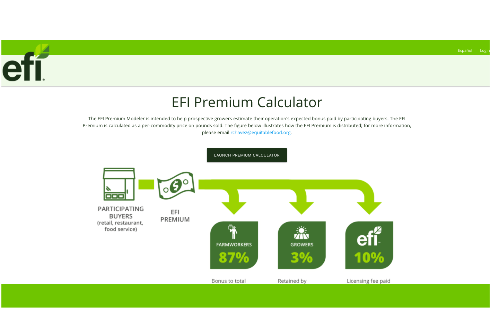
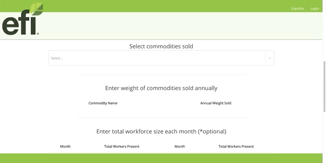
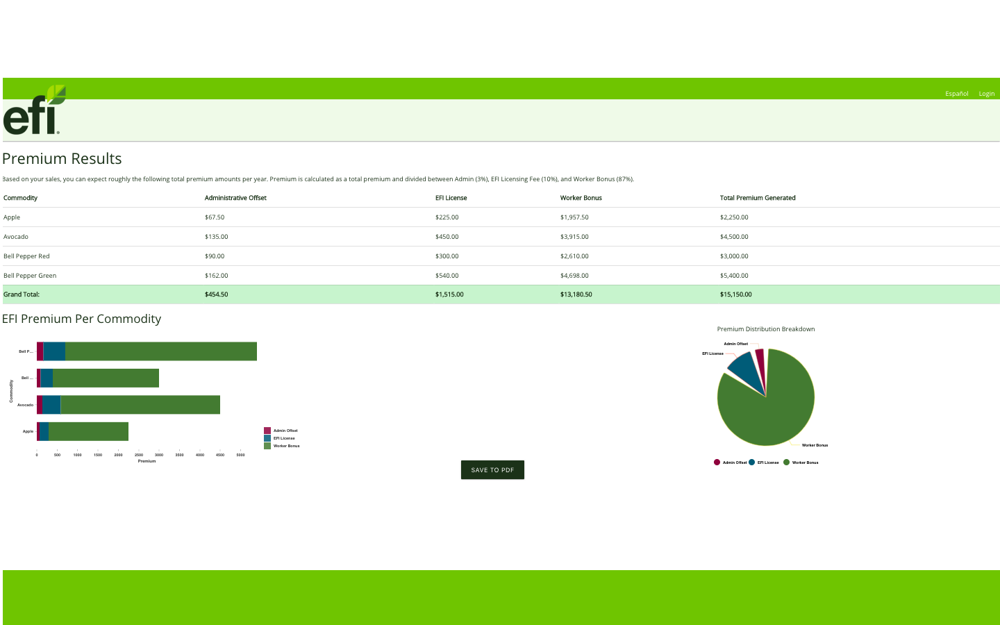

# EFI Premium Calculator (Frontend)

You can check out the current version here! - <a href="www.efipremiumcalculator.com">www.efipremiumcalculator.com </a>

A client acquisition experience for <a href="https://equitablefood.org/about-efi/"> Equitable Food Initiative</a> - the largest ethical-labor farm certification agency in the US. The experience guides farm operators to estimate their return premium from partnering with EFI.  Solo project.

<a href="http://www.linkedin.com/in/christineadoherty"></a>

## Built With...


- <a href="https://reactjs.org/"> ReactJS </a>
- <a href="https://materializecss.com/"> Materialize CSS </a> 
- <a href="https://rubyonrails.org/"> Ruby on Rails</a> API backend
- <a href="https://nivo.rocks/">Nivo</a>

---

## Current Features 

**Dynamic Input Form**

* Estimate potential return premium received based on personalized inputs
* Enter weight in pounds or kilograms
* Specify % sold to partner vendors
* Select unlimited number and type of commodities sold 
* Dynamic weight input form that populates based on current commodities selection



**Results Page**

* Dynamic results table that breaks down estimated premium by commodity sold as well as total 
* Customized Nivo Stacked Bar Chart featuring each commodity and breakdown of premium distribution
* Interactive tooltip
* Pie chart illustrating  % of premium breakdown between Admin, License, and Worker Bonus
* Ability to Save to PDF

<a href="http://www.linkedin.com/in/christineadoherty"></a>

## Future Features

* Ability to generate results based on monthly/quarterly input 
* Option to enter size of workforce per month
* Additional results page illustrating change in Worker Bonus per month
* Call to Action and client outreach through ActionMailer

### Calculation Example 

```javascript 

collectWeights = (e, name) => {
  
    let enteredWeight = e.target.value.toString()
    let intWeight = parseInt(enteredWeight.split().join().replace(/,/g, ''))
    const commodity = this.state.commoditiesSold.filter(comm => comm.label === name)
    const price = commodity.map(com => com.price)
    const kPrice = price*2.20462
    if(this.state.weightInput==="pounds"){
        let newWeights = this.state.weights
        newWeights[name] = intWeight*price
    
        this.setState({
            prices: newWeights,
            
        })
    }else {
        let newWeights = this.state.weights
        newWeights[name] = intWeight*kPrice
    
        this.setState({
            prices: newWeights,
            
        })
    }

    this.calculatePremium()
}
```

## Feedback

Feel free to reach out on <a href="http://www.linkedin.com/in/christineadoherty">LinkedIn</a> with any thoughts or feedback!

Thanks for checking out this repo!!
